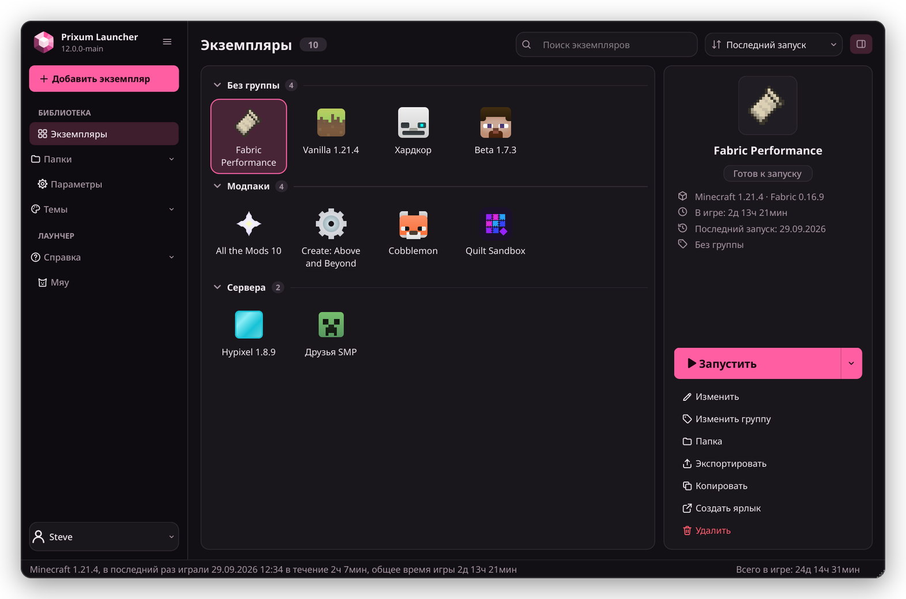
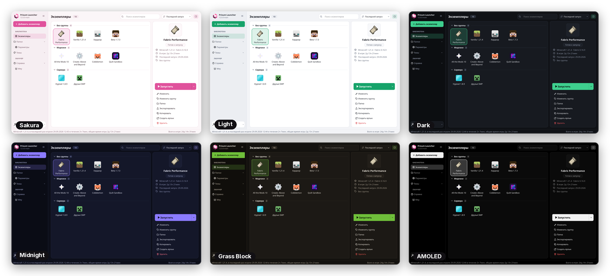
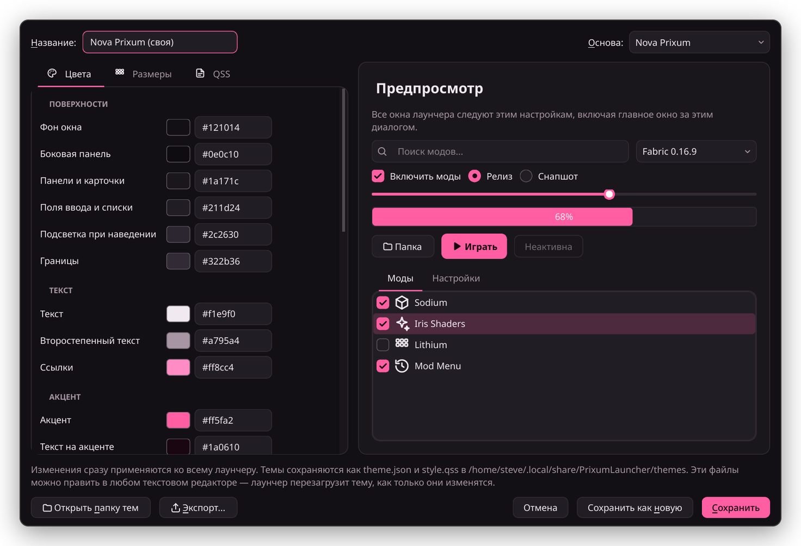
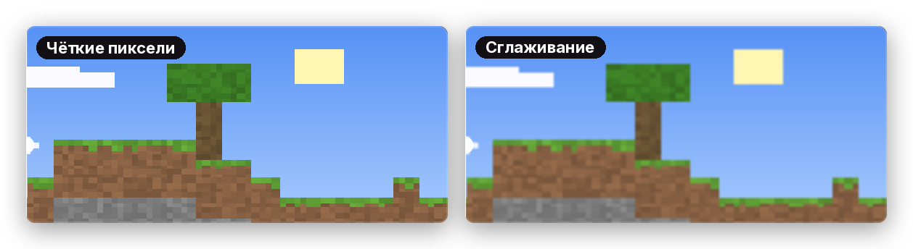
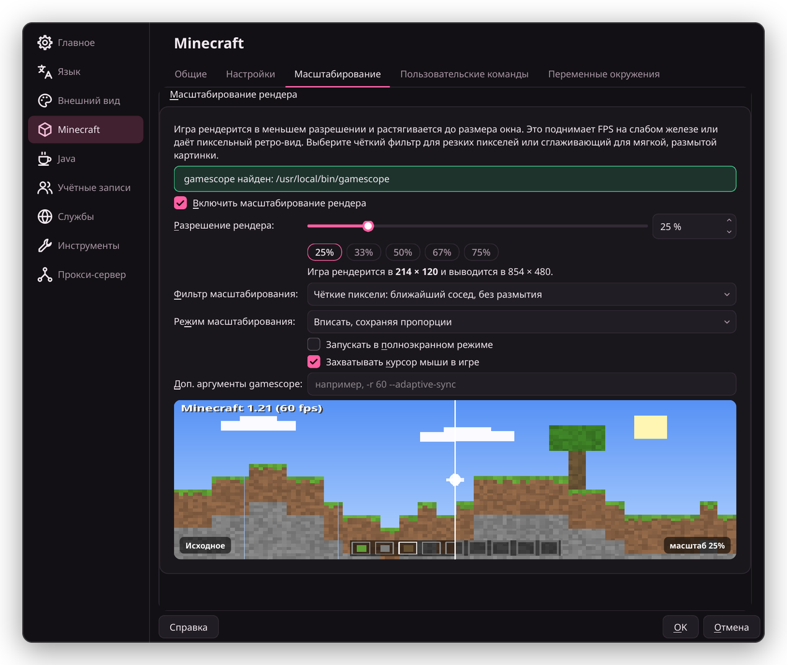
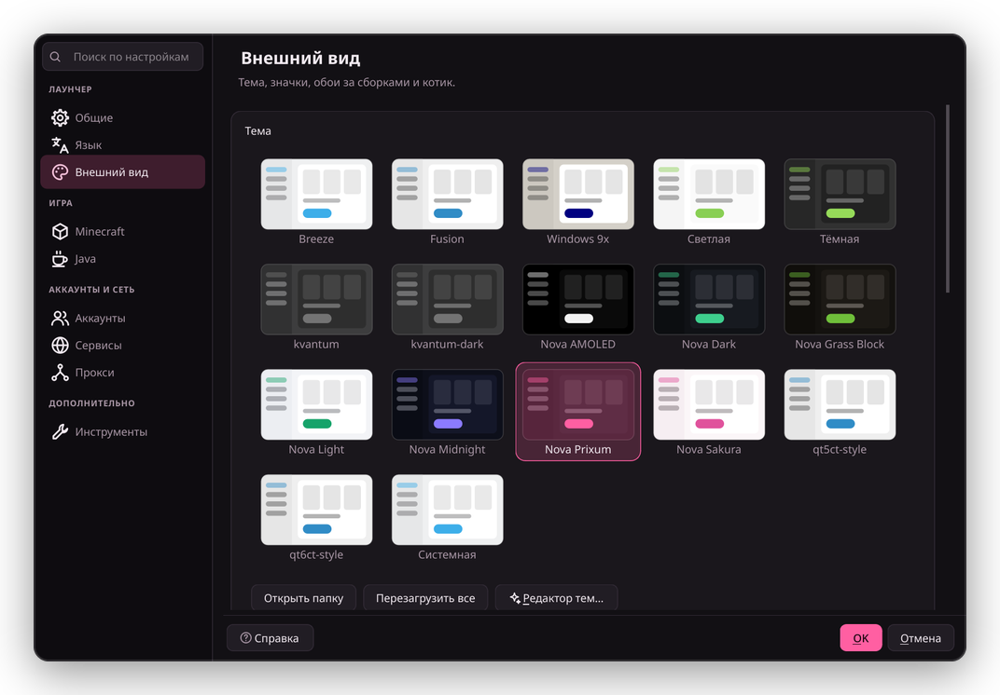
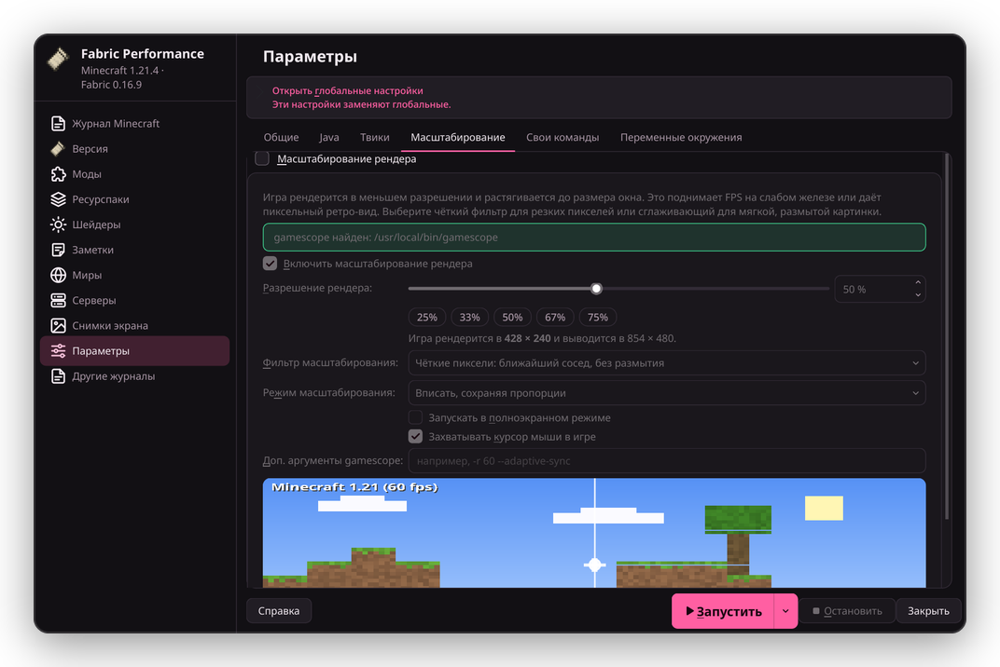

<p align="center">
  <picture>
    <source media="(prefers-color-scheme: dark)" srcset="program_info/org.prixumlauncher.PrixumLauncher.logo-darkmode.svg">
    <source media="(prefers-color-scheme: light)" srcset="program_info/org.prixumlauncher.PrixumLauncher.logo.svg">
    
  </picture>
</p>

<p align="center">
  <b>Лаунчер Minecraft с новым дизайном, редактором тем и масштабированием рендера.</b><br>
  Несколько сборок игры, моды и модпаки, аккаунты Microsoft — всё в одном окне.
</p>

<p align="center">
  <a href="https://github.com/saxxumm/PrixumLauncher/releases/latest"></a>
  <a href="https://github.com/saxxumm/PrixumLauncher/releases"></a>
  
  <a href="LICENSE"></a>
</p>

<p align="center">
  <a href="https://github.com/saxxumm/PrixumLauncher/releases/latest"><b>⬇ Скачать</b></a>
  &nbsp;·&nbsp;
  <a href="#возможности">Возможности</a>
  &nbsp;·&nbsp;
  <a href="#свои-темы">Свои темы</a>
  &nbsp;·&nbsp;
  <a href="#сборка-из-исходников">Сборка</a>
</p>

<p align="center">
  
</p>

> Prixum Launcher — форк [Prism Launcher](https://github.com/PrismLauncher/PrismLauncher), независимый проект.

## Возможности

### Дизайн Nova

Боковая панель, карточки экземпляров с группами, поиск и сортировка, панель справа со временем игры и
большой кнопкой запуска. В комплекте семь тем: тёмная розовая **Prixum** по умолчанию и ещё шесть.

<p align="center">
  
</p>

### Редактор тем

Меняй цвета, скругления, отступы, размеры плиток и панелей, шрифт или допиши свой QSS — весь лаунчер
перерисовывается сразу, а в окне предпросмотра видно, как выглядят кнопки, списки и вкладки.
Готовую тему можно сохранить как новую или выгрузить в папку, чтобы поделиться.

<p align="center">
  
</p>

### Масштабирование рендера

Игра рендерится в пониженном разрешении (от 10 до 100 %) и растягивается до размера окна. Это поднимает FPS
на слабом железе или даёт пиксельный ретро-вид. На выбор четыре фильтра: **чёткие пиксели** без размытия,
**сглаживание**, **AMD FSR** и **NVIDIA NIS** с повышением резкости. Настраивается для всех экземпляров сразу
или для каждого отдельно, живой предпросмотр показывает результат ещё до запуска.

<p align="center">
  
</p>

<p align="center">
  
</p>

> [!NOTE]
> Масштабирование работает на Linux через [gamescope](https://github.com/ValveSoftware/gamescope):
> `sudo pacman -S gamescope`, `sudo apt install gamescope` или `sudo dnf install gamescope`.

### Новые иконки

Свой набор иконок в настройках, редакторе экземпляра и меню. Иконки перекрашиваются под цвета активной темы.

<table>
  <tr>
    <td width="50%"></td>
    <td width="50%"></td>
  </tr>
</table>

### И всё остальное

- вход через аккаунт **Microsoft**, несколько аккаунтов;
- аккаунты **Ely.by** для серверов с авторизацией Ely.by и скинов Ely.by (нужен аккаунт Microsoft с купленным Minecraft);
- модпаки и моды с **Modrinth** и **CurseForge**, загрузчики **Fabric**, **Forge**, **NeoForge** и **Quilt**;
- автоматическая загрузка нужной **Java**;
- импорт и экспорт экземпляров, ярлыки на рабочем столе, portable-режим;
- при первом запуске Prixum предлагает перенести экземпляры, аккаунты и настройки из Prism Launcher —
  исходная папка при этом не меняется.

## Скачать

Все файлы — на странице [последнего релиза](https://github.com/saxxumm/PrixumLauncher/releases/latest),
их имена начинаются с `PrixumLauncher-`.

| Система | Установщик | Portable |
| --- | --- | --- |
| **Windows** 10 / 11 | `Windows-MSVC-Setup` · `.exe` | `Windows-MSVC-Portable` · `.zip` |
| **Windows** на ARM | `Windows-MSVC-arm64-Setup` · `.exe` | `Windows-MSVC-arm64-Portable` · `.zip` |
| **macOS** 13+ | `macOS` · `.dmg` | `macOS-Portable` · `.zip` |
| **Linux** | [`Linux-x86_64.AppImage`](https://github.com/saxxumm/PrixumLauncher/releases/latest/download/PrixumLauncher-Linux-x86_64.AppImage) | `Linux-Qt6-Portable` · `.tar.gz` |
| **Arch / CachyOS** | `prixumlauncher-*.pkg.tar.zst` | — |

Portable-версия хранит экземпляры, аккаунты и настройки внутри своей папки — её можно носить на флешке.

<details>
<summary><b>Windows или macOS не дают запустить?</b></summary>
<br>

Сборки не подписаны сертификатом разработчика.

- **Windows:** в окне SmartScreen нажми «Подробнее» → «Выполнить в любом случае».
- **macOS:** правый клик по приложению → «Открыть», либо в терминале:
  `xattr -dr com.apple.quarantine "/Applications/Prixum Launcher.app"`

</details>

## Свои темы

Тема — это папка в `themes/` с файлом `theme.json` и, если нужно, `style.qss`. Проще всего начать в редакторе тем
(**Темы → Редактор тем…**), но файлы можно править и вручную — лаунчер подхватывает изменения на лету.

```json
{
    "format": "nova",
    "name": "Моя тема",
    "base": "dark",
    "colors": { "accent": "#ff5fa2", "window": "#121014", "surface": "#1a171c" },
    "metrics": { "radius": 16, "cardWidth": 112, "iconSize": 48 }
}
```

Все цвета, размеры и правила для QSS описаны в [PRIXUM.md](PRIXUM.md).

## Сборка из исходников

Нужны Qt 6, CMake, Ninja, extra-cmake-modules и JDK 17 или новее.

```bash
git clone --recursive https://github.com/saxxumm/PrixumLauncher.git
cd PrixumLauncher
cmake -S . -B build -G Ninja -DCMAKE_BUILD_TYPE=Release -DLauncher_ENABLE_JAVA_DOWNLOADER=ON
cmake --build build
```

На Arch и CachyOS пакет собирается и ставится одной командой: `cd packaging/arch && makepkg -si`.
Установщики для Windows, macOS и Linux собирает GitHub Actions при публикации тега — подробности в [PRIXUM.md](PRIXUM.md).

## Лицензия

Код распространяется под [GPL-3.0](LICENSE), сторонние компоненты перечислены в [COPYING.md](COPYING.md).
Логотип основан на логотипе Prism Launcher и доступен под [CC BY-SA 4.0](https://creativecommons.org/licenses/by-sa/4.0/).
